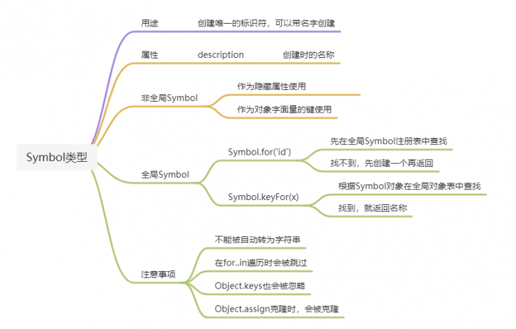

## 1、变量
JavaScript变量是松散型,可以存储任意类型的数据。变量只不过是一个用来存储任意值的命名占位符。有三个关键词可以声明变量:var,let,const。其中，var可以在ECMAScript的所有版本中使用，而let和const只能用于ECMAScript6及之后的版本中。
***
### 1.1 var关键字
#### 1.1.1 var声明作用域
使用var操作符定义的变量会成为包含它的函数的局部变量，该变量在函数退出时销毁。**在函数定义变量时省略var操作符，可以定义一个全局变量**。var声明会在函数执行前创建并将其初始化为undefined。
> 不推荐这么做，局部作用域中定义的全局变量很难维护，而且无法确定是否有意如此。在<u>***"use strict"***</u>模式下，给未声明的变量赋值会抛出ReferenceError；也不能定义名为eval和arguments的变量，否则会导致语法错误。
#### 1.1.2 var声明提升
var定义的变量会自动提升到函数作用域顶部，反复多次使用var声明一个变量，会按照声明顺序倒叙提升到函数作用域顶部。
### 1.2 let声明
#### 1.2.1 let声明作用域
* let声明的范围是函数内部的块作用域，而var声明的作用范围是函数作用域。块作用域是函数作用域的子集，因此，适用于var的作用域限制也适用于let。
* let不允许一个块作用域中出现冗余声明，会报syntaxError。对于let和var混用的声明也会抛出syntaxError，因为他们声明的是同类型的变量，只是指出相关变量如何在作用域存在。
* JavaScript引擎会记录用于变量声明的标识符及其所在的块作用域，因此，嵌套使用相同的标识符不会报错，这是因为同一个块中没有重复声明。
#### 1.2.2 暂时性死区
let声明的变量不会在作用域中被提升。解析代码时，JavaScript引擎会注意到出现在块后面的let声明，不过在此之前不能引用任何未声明的变量，在let声明之前的执行瞬间被称作"暂时性死区"，此阶段引用任何后面才声明的变量，都会抛出ReferenceError。
#### 1.2.3 全局声明
var在全局作用域声明的变量会成为window对象的属性，但是let在全局作用域声明的变量则不会成为window对象。但是，let声明仍是作用在全局作用域中，相应变量也会在页面的生命周期内存续，因此，为了避免syntaxError，必须确保页面不会重复声明同一个变量（参考1.2.1）。
#### 1.2.4 条件声明
var关键字声明的变量作用域会被提升，let关键字声明变量作用域无法提升，而且let作用域范围是函数内部的块，因此无法通过条件语句判断之前是否声明过该变量，而且根据let定义，在无法判断是否已经用let声明过变量情况下，再使用let声明变量可能会导致sytaxError。所以，对于let关键字不能对其依赖条件声明模式。
#### 1.2.5 for循环中的let声明
var是全局作用域，有变量提升的作用，所以在for中定义一个变量，全局可以使用，循环中的每一次给变量i赋值都是给全局变量i赋值。   
在for语句中，使用var和let声明关键字，其内部函数输出结果不同，原因在于var声明的变量会自动提升为全局变量，因此循环结束后的最终值为该全局变量的值，之后再执行内部循环逻辑函数；而使用let则会在内部循环块内，每次都为改改循环变量创建一个循环逻辑函数，这些函数变量不会相互干扰，因此会输出每个变量值。
```javascript    
    var a=[];
        for(var i=0;i<3;i++){
            a[i]= function(){
                console.log(i);
        }    
    }
    for语句解析为：
    {
        var i=0;
        if(0<3){
            a[0]=function(){
               console.log(i);
            }
        };
        i++;//i=1
        if(1<3){
            a[1]=function(){
                console.log(i);
             }
        };
        i++;//i=2
        if(2<3){
            a[2]=function(){
                console.log(i);
             }
        };
        i++;//i=3
        //a[0]开始执行i=0,直到要跳出函数时i=3，因此，console.log(i)执行结果为3。   
        //对于var声明来说a[i]参数i从几开始并不重要，因为当其不满足循环条件退出返回结果时i都等于3，因此其函数主体console.log(i)都为3。
        //变量i是var命令声明的，在全局范围内都有效，所以全局只有一个变量i。每一次循环，变量i的值都会发生改变，而循环内被赋给数组a的函数内部的console.log(i)，里面的i指向的就是全局的i。也就是说，所有数组a的成员里面的i，指向的都是同一个i，导致运行时输出的是最后一轮的i的值，也就是 10。
    }    
    a[0]//3
    a[1]//3
    a[2]//3
    当用let替换var声明for语句条件时：
    for(let i=0;i<3;i++){
        a[i]=function(){
            console.log(i);
        }
    }
    for语句解析为：
    {
        let i=0;
        if(0<3){
            let j=i;
            a[j]=function(){
                console.log(j);
             }
         };
         i++;//i=1
         if(1<3){
            let j=i;
            a[j]=function(){
                console.log(j);
             }
         };
         i++;//i=**2**
         if(2<3){
            let j=i;
            a[j]=function(){
                console.log(j);
             }
         };
         i++//i=3
         //跳出循环，因为let声明变量为块作用域，因此三个函数的变量j都是各自块内的独立的变量，互不干扰。
         //变量i是let声明的，当前的i只在本轮循环有效，所以每一次循环的i其实都是一个新的变量，所以最后输出的是6。你可能会问，如果每一轮循环的变量i都是重新声明的，那它怎么知道上一轮///循环的值，从而计算出本轮循环的值？这是因为JavaScript引擎内部会记住上一轮循环的值，初始化本轮的变量i时，就在上一轮循环的基础上进行计算。
         //另外，for循环还有一个特别之处，就是设置循环变量的那部分是一个父作用域，而循环体内部是一个单独的子作用域。
    }
```
<u></u>
### 1.2 const声明   
const声明变量必须给变量赋值，且赋值后不可更改变量值，否则会报错；于let声明一样const声明也是块级作用域；对数组和对象的内部属性修改，不算做对const声明对象的修改，不报错。
```
const a=[1,2]
a.push(3)
console.log(a)//1,2,3
//声明数组或是对象的时候，使用 const 是比较稳妥的，可以避免声明变量变动错误。
```
<u></u>
## 2、数据类型
boolean类型有两个字面值：true和false；这两个值不同于数值，因此true不等于1，false不等于0；布尔值true和false是区分大小的，因此True和False（及其他大小写混合）是有效标识符，但不是布尔值。   
> **不同类型和布尔值之间转换规则。**                           

|   数据类型   |   转换为true的值   |   转换为false的值   |
|   -------   |   --------------   |   --------------   |
|   Boolean   |        true        |        false       |
|   String    |      非空字符串     |    ""（空字符串）  |
|   Number    | 非零数值（包括无穷）|        0、NaN      |
|   Object    |      任意对象      |        null         |
|Underfined   |  N/A（不存在）    |      underfined     |
### 模板字面量的标签函数
1、语法结构function 函数名(模板字面量中原始字符串数组，插值1，插值2...){}   
> 第一个参数必须是模板字面量原始字符串组成的数组；   
> 从第二个参数开始，与模板字面量中的插值一一对应。   
### 解构赋值
> {name,age,sex:gender="male"}=object,如果object没有sex，责sex为underfined，sex可设置默认值，或者改变变量名称。   
> [a,...b]=[1,2,3,4]使用rest oprator操作符获取剩余全部，[a,,c]使用逗号跳过不想要的元素。

### 原始字符串   
使用模板字面量也可以直接获取最原始的模板字面量内容（比如换行符或者Unicode字符），而不是被转换后的字符，为此，可以使用string.raw标签函数。
### symol类型   
   
    